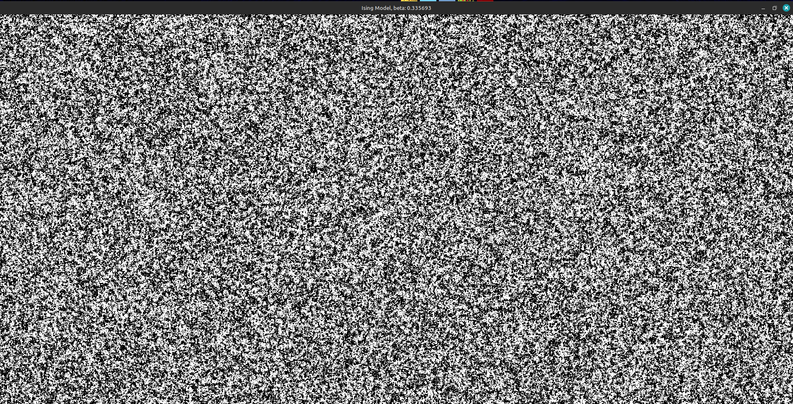
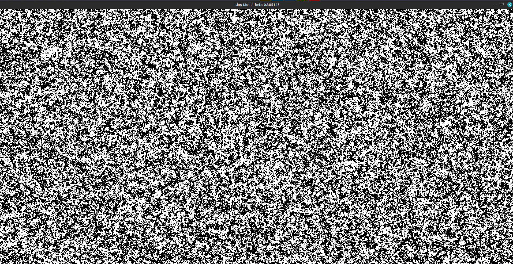
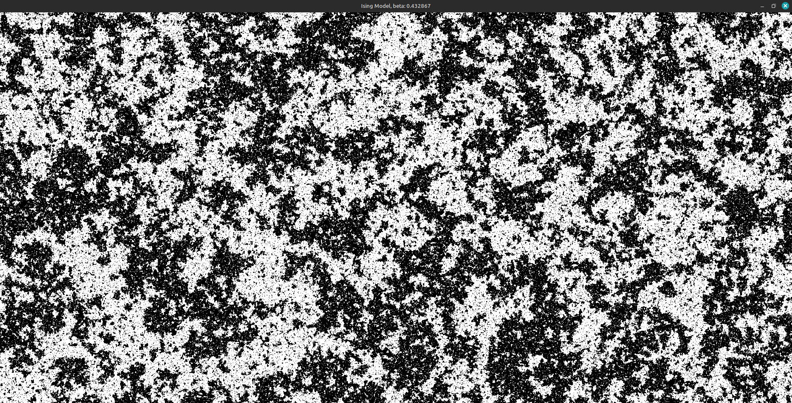
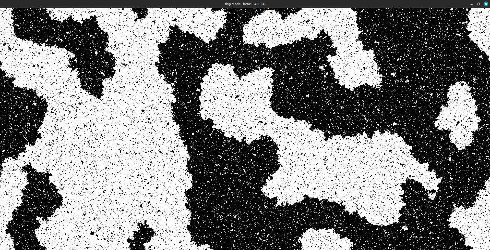
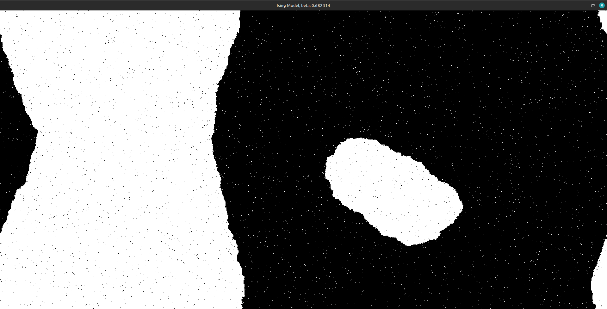

# Ising Model Simulation using CUDA

Ising model is used to understand the temperature dependence of magnets.

Metropolis algorithm is used to simulate the statistical evlution of the state.

The beta parameter is varied.
Refer to this: [https://en.wikipedia.org/wiki/Ising_model](https://en.wikipedia.org/wiki/Ising_model)

    